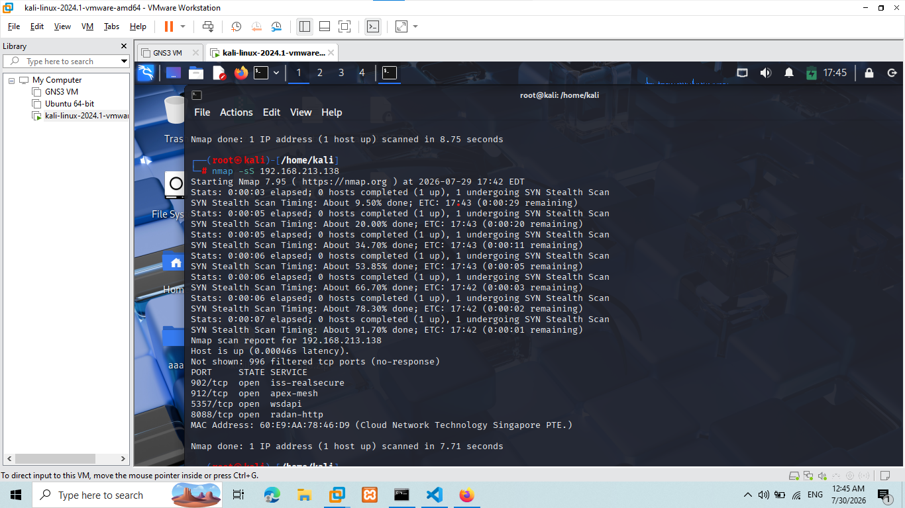
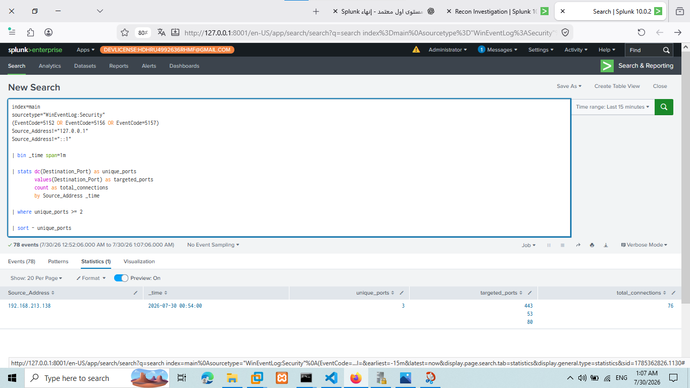
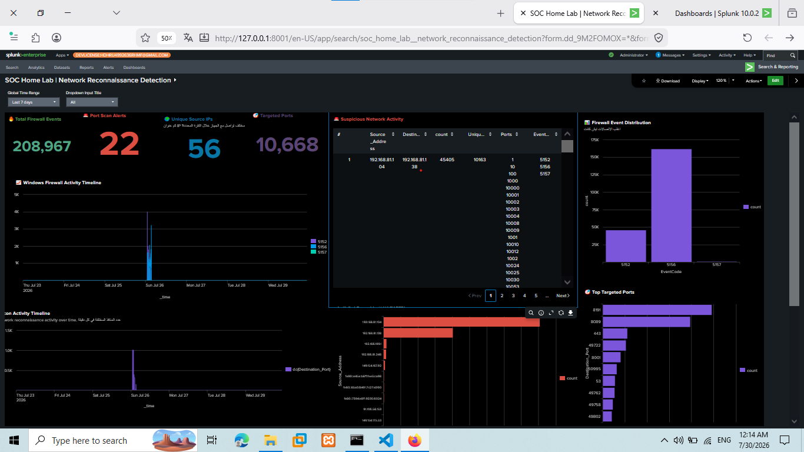
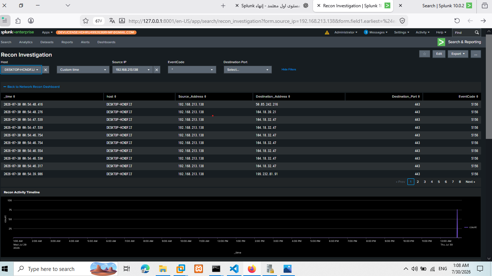
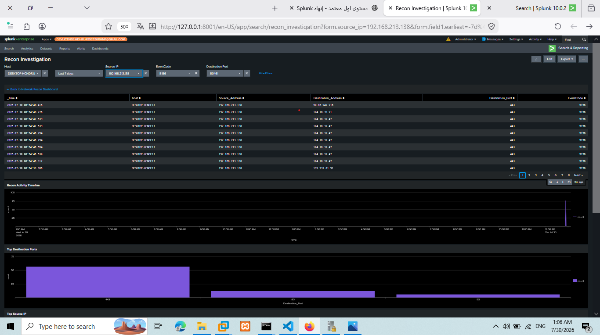
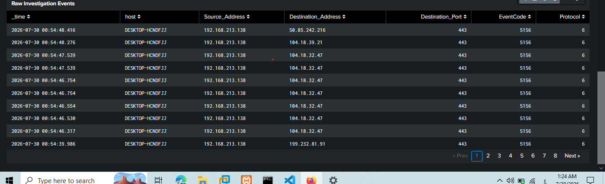

# Network Reconnaissance Detection using Splunk

## Overview

This case study demonstrates how network reconnaissance activity was simulated, detected, and investigated using Splunk Enterprise.

The objective was to emulate an attacker performing port scanning against a Windows endpoint and build a complete SOC investigation workflow using Windows Security Event Logs, SPL detection rules, interactive dashboards, and incident documentation.

---

## Lab Environment

| Component | Description |
|------------|------------|
| SIEM | Splunk Enterprise |
| Attacker | Kali Linux |
| Target | Windows 10 |
| Telemetry | Windows Security Logs + Sysmon |
| Log Forwarder | Splunk Universal Forwarder |

---

## Attack Simulation

Network reconnaissance was performed using **Nmap** from the Kali Linux attacker machine.

Attack commands are available here:

📄 [`attack/nmap_commands.txt`](./attack/nmap_commands.txt)

### Attack Evidence

---

## Detection Engineering

A custom SPL detection was developed to identify reconnaissance activity by monitoring Windows Filtering Platform events (5152, 5156, and 5157) and counting unique destination ports contacted within a short time window.

Detection rule:

📄 [`detection/spl_query.txt`](./detection/spl_query.txt)

### Detection Search Result

---

## Detection Dashboard

The Network Reconnaissance Detection Dashboard provides analysts with a high-level view of reconnaissance activity through interactive visualizations, dynamic filters, and real-time monitoring.

Dashboard capabilities include:

- Recon Activity Timeline
- Top Source IP
- Top Targeted Ports
- Interactive Filters
- Drilldown Investigation

### Dashboard Preview

---

## Investigation Workflow

Selecting a suspicious Source IP automatically opens the investigation dashboard, allowing analysts to continue the investigation without manually modifying search queries.

### Drilldown Workflow

---

## Recon Investigation Dashboard

The investigation dashboard enables detailed event analysis by providing:

- Source IP filtering
- Host filtering
- EventCode filtering
- Raw Windows Security Events
- Timeline Analysis

### Investigation Preview

---

## Evidence Review

Raw Windows Security Events were reviewed to validate the detection and confirm reconnaissance activity.

### Raw Events

---

## Incident Report

The complete investigation report is available here:

📄 [`incident_report.md`](./incident_report.md)

---

## MITRE ATT&CK Mapping

| Technique | Description |
|-----------|-------------|
| T1046 | Network Service Scanning |

---

## Skills Demonstrated

- Splunk Enterprise
- SPL Query Development
- Detection Engineering
- Windows Security Event Analysis
- Dashboard Studio
- SOC Investigation
- Threat Hunting
- MITRE ATT&CK Mapping