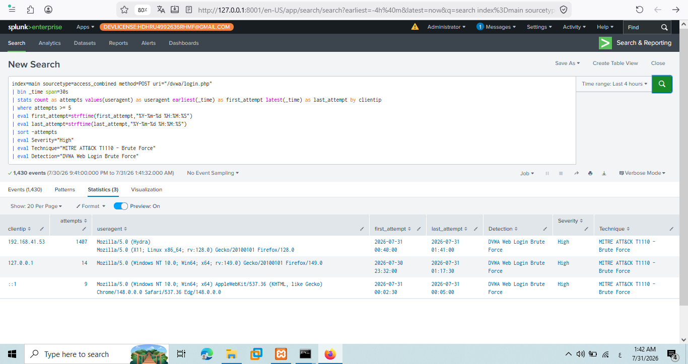
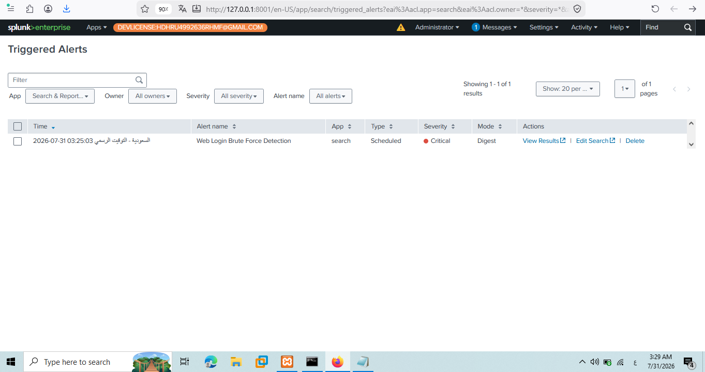
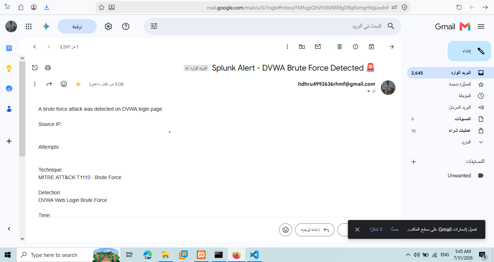
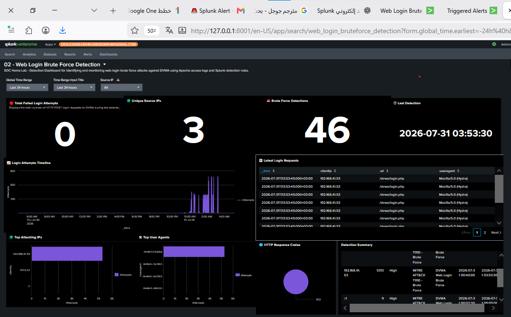
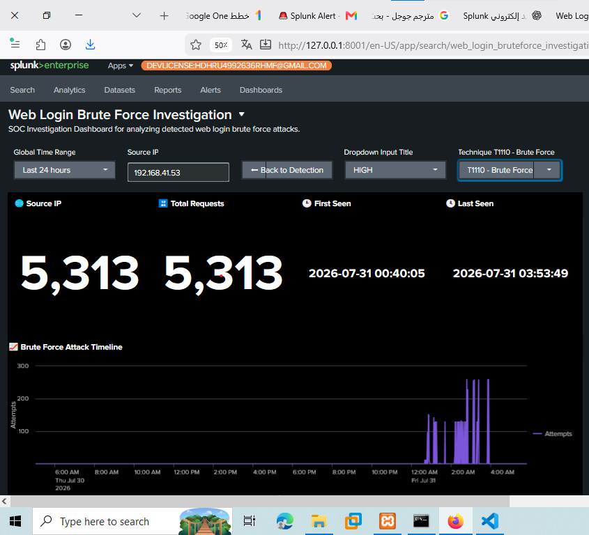
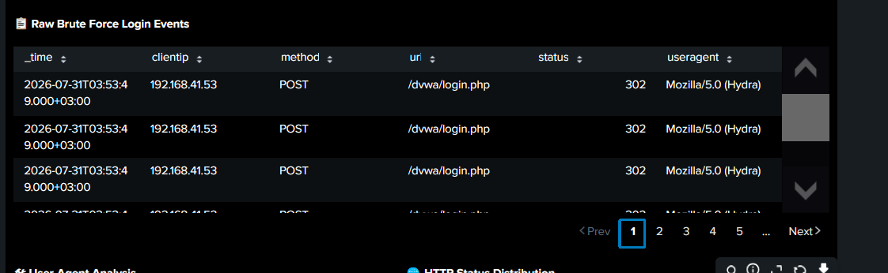

# Web Login Brute Force Detection using Splunk

## Overview

This case study demonstrates how a Web Login Brute Force attack was simulated, detected, investigated, and documented using Splunk Enterprise.

The objective was to emulate an attacker performing automated login attempts against DVWA using Hydra and build a complete SOC workflow including detection engineering, automated alerting, email notifications, investigation dashboards, and incident documentation.

---

# Lab Environment

| Component   | Description                            |
| ----------- | -------------------------------------- |
| SIEM        | Splunk Enterprise                      |
| Attacker    | Kali Linux                             |
| Target      | DVWA (Damn Vulnerable Web Application) |
| Attack Tool | Hydra                                  |
| Log Source  | Apache Access Logs                     |
| Alerting    | Scheduled Alert + Email Notification   |

---

# Attack Simulation

A brute force attack was executed against the DVWA login portal using Hydra to generate repeated HTTP POST authentication attempts.

Attack commands are available here:

📄 **[attack/hydra_commands.txt](attack/hydra_commands.txt)**

---

# Attack Evidence

Hydra Execution


---

# Detection Engineering

A custom SPL detection rule was developed to identify excessive login attempts originating from the same source IP within a 30-second time window.

Detection rule:

📄 **[detection/spl_query.txt](detection/spl_query.txt)**

---

# Detection Search Result

The SPL search successfully identified the brute force activity generated during the attack simulation.

Detection Search



---

# Alert Generation

A scheduled Splunk alert was configured to automatically detect brute force behavior whenever the defined threshold was exceeded.

Alert Triggered



---

# Email Notification

When the alert conditions were met, Splunk automatically sent an email notification to the SOC analyst.

Email Notification



---

# Detection Dashboard

A dedicated Detection Dashboard was created to provide analysts with a high-level overview of brute force activity.

Dashboard capabilities include:

* Login Attempt Timeline
* Top Attacking Source IPs
* Total Login Attempts
* Detection Summary
* Interactive Time Range Filter
* Source IP Filter
* Drilldown Investigation

Dashboard Preview



---

# Investigation Workflow

Selecting a suspicious Source IP from the Detection Dashboard automatically opens the Investigation Dashboard while passing the selected IP using dashboard tokens.

Drilldown Workflow



---

# Investigation Dashboard

The Investigation Dashboard enables analysts to perform detailed event analysis through interactive visualizations.

Features include:

* Source IP Investigation
* Attack Timeline
* Raw Login Events
* User-Agent Analysis
* HTTP Status Distribution
* Incident Summary
* Severity Classification
* MITRE ATT&CK Mapping

Investigation Preview


---

# Evidence Review

Raw Apache Access Log events were reviewed to validate the detection and confirm the brute force attack.

Raw Events



---

# Incident Report

The complete incident investigation report is available here:

📄 **[incident_report.md](incident_report.md)**

---

# MITRE ATT&CK Mapping

| Technique | Description |
| --------- | ----------- |
| T1110     | Brute Force |

---

# Project Workflow

```text
Hydra Attack
      │
      ▼
Apache Access Logs
      │
      ▼
Splunk Detection Rule
      │
      ▼
Scheduled Alert
      │
      ▼
Email Notification
      │
      ▼
Detection Dashboard
      │
      ▼
Drilldown Investigation
      │
      ▼
Investigation Dashboard
      │
      ▼
Incident Report
```

---

# Skills Demonstrated

* Splunk Enterprise
* SPL Query Development
* Detection Engineering
* Web Application Security Monitoring
* Apache Access Log Analysis
* Dashboard Studio
* Alert Engineering
* Email Notification Configuration
* SOC Investigation Workflow
* Threat Hunting
* MITRE ATT&CK Mapping
* Incident Response Documentation
