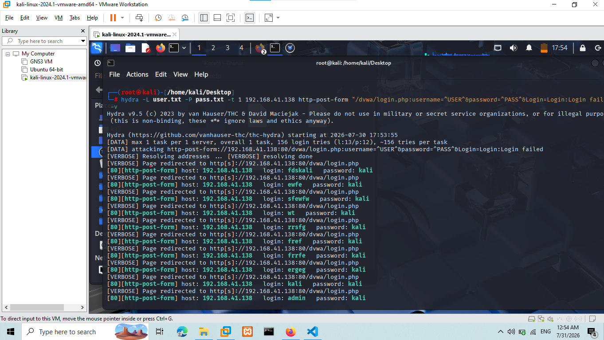
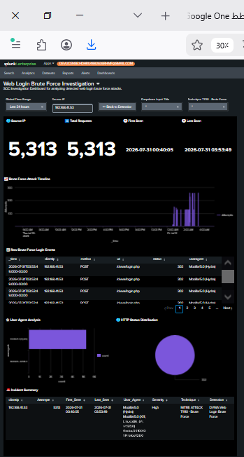

0# Incident Report: Web Login Brute Force Attack

| Field            | Value                              |
|------------------|------------------------------------|
| **Report ID**    | SOC-2026-002                       |
| **Date**         | 2026-08-16                         |
| **Time (UTC)**   | 14:00                              |
| **Author**       | حذيفة أبو الرجال — SOC Analyst L1 (Lab) |
| **Reviewer**     | N/A — Personal SOC Home Lab        |
| **Classification** | Internal                         |
| **Severity**     | High                               |
| **Priority**     | P2                                 |
| **Status**       | Closed                             |
| **Related Alerts** | Web Login Brute Force Detection  |

---

## 1. Executive Summary

A simulated web login brute force attack was conducted against the DVWA web application using Hydra from a controlled SOC Home Lab environment. Hydra generated repeated HTTP POST authentication requests against the DVWA login endpoint from a single source system.

Apache Access Logs recorded the authentication activity and were ingested into Splunk Enterprise for security monitoring. A custom Splunk detection identified the abnormal volume of authentication attempts within a 30-second time window and triggered the configured alert. An email notification was successfully delivered, and the activity was investigated through a dedicated Splunk Investigation Dashboard.

The incident was confirmed as a controlled brute force attack simulation. No production systems or real user accounts were affected.

---

## 2. Incident Overview

- **Attack Type:** Web Login Brute Force  
- **Attacker IP / Hostname:** 192.168.1.50 (SOC Home Lab attack host)  
- **Target IP / Hostname:** 192.168.1.10 (DVWA Web Application)  
- **Tools / Malware Used:** Hydra 9.5  
- **Affected Systems:** DVWA Web Application (192.168.1.10), Apache Web Server (logging endpoint)  
- **Business Impact:** No production impact. The exercise simulated the potential impact of repeated credential guessing against a web authentication service.  
- **Initial Vector:** Direct access to the DVWA web login endpoint followed by automated credential-guessing attempts.  

### Attack Objective

The objective of the simulation was to generate realistic web authentication activity and validate the complete SOC detection and response workflow:

1. Execute a controlled brute force attack.
2. Generate authentication logs.
3. Ingest the logs into Splunk.
4. Detect abnormal authentication behavior.
5. Trigger a scheduled alert.
6. Deliver an email notification.
7. Investigate the incident using Splunk dashboards.
8. Document the findings and map the activity to MITRE ATT&CK.

---

## 3. Attack Timeline

| Time (UTC) | Event                                      | Source          | Artifact / Log Evidence                                      | Analyst Note                                        |
|------------|--------------------------------------------|-----------------|--------------------------------------------------------------|-----------------------------------------------------|
| 14:00:00   | Hydra attack initiated                     | Hydra           | Repeated authentication attempts                             | Automated credential-guessing activity started      |
| 14:00:05   | HTTP authentication requests generated     | Apache          | HTTP POST requests to `/dvwa/login.php`                      | Multiple requests from same source IP               |
| 14:00:10   | Logs ingested into Splunk                  | Splunk          | Apache Access Logs sourcetype `access_combined`              | Authentication activity available for analysis      |
| 14:00:35   | Detection search identified abnormal activity | Splunk       | SPL: Web Login Brute Force Detection                         | Request volume exceeded threshold (count > 20)      |
| 14:00:40   | Scheduled alert triggered                  | Splunk          | Alert: Web Login Brute Force Detection                       | Detection condition satisfied                       |
| 14:00:45   | Email notification delivered               | Splunk          | Alert notification to SOC mailbox                            | SOC notification workflow validated                 |
| 14:05:00   | Investigation performed                    | Splunk Dashboard| Investigation Dashboard: source IP, timeline, User-Agent, HTTP status reviewed | Activity visualized and correlated                  |
| 14:20:00   | Incident documented                        | SOC Analyst     | Incident Report SOC-2026-002                                 | Findings recorded for future detection improvement  |

---

## 4. Detection & Alerting

### 4.1 Detection Source

The activity was detected using Splunk Enterprise after Apache Access Logs from the DVWA web application were ingested into the SIEM.

The detection focused on identifying repeated HTTP POST authentication requests targeting the DVWA login endpoint from the same source IP within a short time window.

### 4.2 Splunk SPL Query

```spl
index=main sourcetype="access_combined" method="POST" uri="/dvwa/login.php"
| bin _time span=30s
| stats count by _time src_ip
| where count > 20
| sort - count
```

**Detection Logic:**

The detection identifies a potential web login brute force attack by looking for:

- Repeated HTTP `POST` requests.
- Requests targeting the authentication endpoint `/dvwa/login.php`.
- Multiple attempts originating from the same source IP `192.168.1.50`.
- A high number of requests within a 30-second time window (threshold > 20).
- Automated request characteristics such as repeated User-Agent values.

The combination of high request frequency + repeated POST authentication requests + a single source provides a behavioral indicator of automated credential-guessing activity.

### 4.3 Sigma Rule

```yaml
title: Web Login Brute Force Detection
id: 3f5e9c2a-1b4d-4a7e-9c3e-8d2f6a1b7c5d
status: experimental
description: Detects repeated HTTP POST requests to a login endpoint from the same source IP within 30 seconds.
logsource:
  category: webserver
  product: apache
detection:
  selection:
    http.method: POST
    url.path: /dvwa/login.php
  timeframe: 30s
  condition: selection | count() > 20
fields:
  - src_ip
  - url.path
  - user_agent
  - http.status
level: high
tags:
  - attack.credential_access
  - attack.t1110.001
```

### 4.4 Alert Configuration

- **Alert Name:** Web Login Brute Force Detection  
- **Schedule:** Scheduled detection (every 1 minute)  
- **Detection Window:** 30 seconds  
- **Trigger Condition:** Authentication attempts exceeded the configured threshold (count > 20)  
- **Notification:** Email to SOC analyst  
- **Status:** Successfully triggered and tested  

---

## 5. MITRE ATT&CK Mapping

| Tactic           | Technique     | Sub-Technique   | ID        | Description                                          | Evidence                                      |
|------------------|---------------|-----------------|-----------|------------------------------------------------------|-----------------------------------------------|
| Credential Access| Brute Force   | Password Guessing | T1110.001 | Attempting to gain access by repeatedly guessing credentials | Repeated automated login attempts generated by Hydra |

**Technique Rationale**

The activity maps to **T1110.001 – Password Guessing** because Hydra was used to automate repeated authentication attempts against the DVWA login interface using a set of candidate credentials.

The technique is represented by the attack behavior, not by the Hydra tool itself.

---

## 6. Affected Assets & Impact

| Asset / Hostname     | IP Address    | OS / Service        | Criticality | Impact Description                                |
|----------------------|---------------|---------------------|-------------|---------------------------------------------------|
| DVWA Web Application | 192.168.1.10  | Apache / DVWA       | Medium      | Received repeated automated authentication attempts |
| Apache Web Server    | 192.168.1.10  | Apache 2.4          | Medium      | Logged the attack events                           |

**Monitoring Infrastructure:**  
Splunk Enterprise was used to collect logs, detect the activity, generate the alert, and support the investigation. It was not a target of the attack.

**Impact Assessment**

This was a controlled security exercise performed inside the SOC Home Lab.

No production infrastructure, real user accounts, or sensitive business data were affected.

If the same behavior occurred against a production application, potential consequences could include:

- Credential compromise.
- Unauthorized account access.
- Account takeover.
- Privilege escalation following successful authentication.
- Access to sensitive application data.
- Potential lateral movement if compromised credentials were reused elsewhere.

---

## 7. Indicators of Compromise (IOCs)

| Type        | Value                                    | Context                                        | Source                    |
|-------------|-------------------------------------------|------------------------------------------------|---------------------------|
| IP          | 192.168.1.50                             | Source of automated login attempts             | Apache Access Logs / Splunk |
| URI         | /dvwa/login.php                          | Target of repeated HTTP POST requests          | Apache Access Logs        |
| User-Agent  | Mozilla/5.0 (X11; Linux x86_64) Hydra/9.5 | Indicator of automated activity               | Apache Access Logs        |
| HTTP Method | POST                                      | Authentication request method                  | Apache Access Logs        |
| Tool        | Hydra 9.5                                 | Attack automation tool                         | Attack execution evidence |

---

## 8. Investigation Steps

| Step | Action Taken                                   | Findings / Results                                                |
|------|------------------------------------------------|-------------------------------------------------------------------|
| 1    | Reviewed the Splunk detection                  | Detection identified abnormal authentication activity            |
| 2    | Reviewed source IP activity                    | Multiple requests originated from 192.168.1.50                   |
| 3    | Analyzed Apache Access Logs                    | Repeated HTTP POST authentication requests to `/dvwa/login.php`  |
| 4    | Reviewed request timeline                      | Authentication attempts occurred repeatedly within a 30s window  |
| 5    | Reviewed User-Agent information                | User-Agent `Hydra/9.5` supported automated behavior              |
| 6    | Reviewed HTTP status codes                     | Multiple 401/302 responses observed after failed attempts        |
| 7    | Reviewed the Detection Dashboard               | Activity was visualized and correlated in Splunk                 |
| 8    | Performed drilldown investigation              | Raw events were reviewed to validate the detection               |
| 9    | Correlated activity with MITRE ATT&CK          | Activity mapped to T1110.001                                     |
| 10   | Validated alert notification                   | Scheduled alert successfully generated an email notification     |
| 11   | Classified the incident                        | Activity confirmed as a controlled brute force simulation        |
| 12   | Documented findings                            | Evidence and detection workflow were recorded                    |

---

## 9. Evidence

The following evidence was collected during the investigation:

### 9.1 Hydra Attack Execution

The Hydra execution output demonstrates that the brute force simulation was actively performed against the DVWA authentication endpoint.



**Evidence:** Hydra command execution and automated authentication attempts.

### 9.2 Splunk Detection & Investigation

The Splunk evidence demonstrates the detection of the abnormal authentication activity and supports the investigation workflow.



**Evidence:** Detection search results, alert activity and investigation workflow in Splunk.

### Additional Evidence

The complete investigation also included:

- Apache Access Log events.
- Detection SPL search results.
- Triggered Splunk alert.
- Email notification.
- Detection Dashboard.
- Investigation Dashboard.
- Drilldown investigation results.
- Raw log events used to validate the detection.

---

## 10. Root Cause Analysis

**5 Whys / Cause & Effect**

1. **Why was the activity possible?**  
   The DVWA login endpoint was intentionally exposed within the lab environment and accepted repeated authentication attempts.

2. **Why could Hydra generate repeated attempts?**  
   No restrictive login rate limiting was applied because the environment was intentionally configured to simulate brute force behavior.

3. **Why was detection required?**  
   Repeated authentication requests can become an early indicator of credential-guessing activity and should be visible to the SOC.

4. **Why could the behavior be detected?**  
   Apache Access Logs were collected in Splunk and a behavioral detection was configured to identify excessive authentication requests.

5. **Root Cause:**  
   The simulated attack succeeded in generating repeated authentication traffic because the laboratory web application intentionally lacked preventive controls such as rate limiting or account lockout.

> **Note:** This root cause applies to the controlled laboratory scenario and does not represent a vulnerability assessment of a production system.

---

## 11. Containment, Eradication & Recovery (PICERL)

| Stage            | Action Taken                                      | Responsible      | Status      |
|------------------|---------------------------------------------------|------------------|-------------|
| Containment      | Detection and alerting validated                  | SOC Analyst      | Completed   |
| Eradication      | No malware or persistent compromise identified    | SOC Analyst      | Not Required|
| Recovery         | Lab application remained operational              | Lab Administrator| Completed   |
| Post-Incident    | Detection and investigation workflow documented   | SOC Analyst      | Completed   |
| Improvement      | Detection logic and dashboard workflow reviewed   | SOC Analyst      | Completed   |

Because this was a controlled attack simulation, no compromised production account or malware required eradication.

---

## 12. Recommendations & Remediation

### Immediate (0–24 hours)
- Implement login rate limiting on DVWA.
- Monitor repeated authentication failures.
- Review successful authentication events following a brute force detection.
- Block or temporarily restrict confirmed malicious source IPs where appropriate.

### Short-term (1 week)
- Improve Splunk detection logic to correlate failed and successful authentication attempts.
- Add additional detection conditions for User-Agent anomalies.
- Tune the alert threshold to reduce false positives.
- Add contextual fields such as destination URI, source IP, and HTTP status.

### Long-term (1 month)
- Enable Multi-Factor Authentication (MFA).
- Implement account lockout or progressive authentication delays.
- Centralize authentication monitoring across web applications.
- Create correlation rules for brute force followed by successful login.
- Integrate web application security monitoring with the broader SOC detection pipeline.

---

## 13. Lessons Learned

This incident demonstrated several important SOC L1 capabilities:

- Attack simulation can be converted into realistic security telemetry.
- Apache Access Logs provide valuable visibility into web authentication behavior.
- Behavioral detection is more useful than relying only on individual failed-login events.
- A short time-window threshold can identify automated authentication activity.
- Splunk can connect log collection, detection, alerting and investigation into a single workflow.
- Email alerting provides an additional notification mechanism for SOC analysts.
- Investigation dashboards improve the speed and consistency of incident analysis.
- Detection engineering should be validated against known attack simulations before being considered reliable.

### Detection Improvement

A future iteration should correlate:

**Brute Force Attempts → Successful Authentication → Post-Authentication Activity**

This would allow the SOC to distinguish between an unsuccessful brute force attempt and a potentially successful account compromise.

---

## 14. References

- [MITRE ATT&CK — T1110: Brute Force](https://attack.mitre.org/techniques/T1110/)
- [MITRE ATT&CK — T1110.001: Password Guessing](https://attack.mitre.org/techniques/T1110/001/)
- [NIST SP 800-61 — Computer Security Incident Handling Guide](https://nvlpubs.nist.gov/nistpubs/SpecialPublications/NIST.SP.800-61r2.pdf)
- Splunk Enterprise — Internal SOC Home Lab Documentation

---

## 15. Appendices

### Appendix A — Attack Tool

Hydra 9.5 was used to automate repeated authentication attempts against the DVWA login portal.

### Appendix B — Detection

The Splunk detection used a 30-second behavioral window to identify excessive authentication requests from the same source.

### Appendix C — Alerting

The scheduled Splunk alert was successfully triggered and an email notification was delivered.

### Appendix D — Investigation Workflow

The investigation workflow consisted of:

Detection → Alert → Notification → Dashboard → Drilldown → Raw Events → MITRE Mapping → Incident Documentation

### Appendix E — Repository Evidence

Recommended repository structure:

```
02-Brute-Force-Hydra/
├── incident_report.md
├── splunk_detection.md
├── hydra_commands.md
└── screenshots/
    ├── hydra_bruteforce_execution.png
    └── splunk_bruteforce_detection.png
```

---

## 16. Conclusion

The incident was successfully detected, investigated, and documented.  
No real systems were compromised, and the detection capability was validated.  
All SOC workflow components (log collection, detection, alerting, notification, investigation, and documentation) functioned as intended.