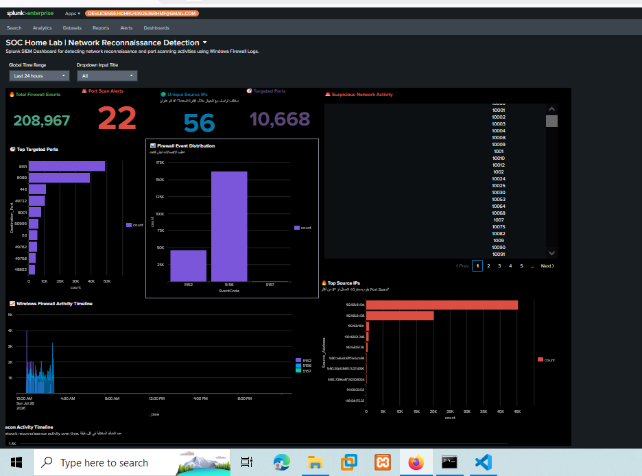
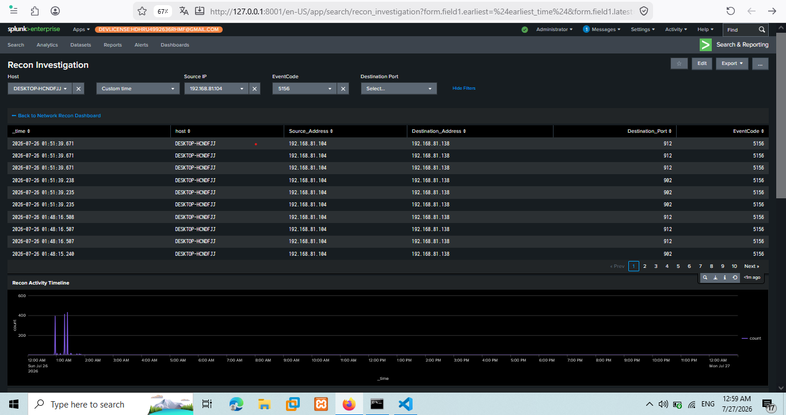

# 🛡️SOC Home Lab | Detection Engineering & Threat Hunting using Splunk

<!-- Badges Section -->


---

## 📌 Overview

A practical Security Operations Center (SOC) home lab built with **Splunk Enterprise** simulate realistic cyber attack scenarios, engineer robust detection rules (SPL), conduct in-depth threat hunting, and create interactive, SOC-oriented investigation dashboards.

This lab demonstrates the complete detection lifecycle by combining attack simulation, **telemetry collection**, **detection engineering**, and SOC investigation workflows using Splunk Enterprise.

---

## 📸 Dashboard Preview

### Network Reconnaissance Detection Dashboard



---

### Recon Investigation Dashboard



---

## 🎯 Key Objectives

- 🎯 **Attack Simulation:** Execute real-world adversary TTPs (Techniques, Tactics, and Procedures) aligned with the MITRE ATT&CK framework.
- 📡 **Telemetry Collection:** Ingest Windows Event Logs, Sysmon, and Network telemetry into Splunk SIEM.
- 🔍 **Detection Engineering:** Build, test, and optimize custom Search Processing Language (SPL) queries to detect malicious behavior.
- 📊 **Interactive Dashboards:** Design dynamic Splunk Studio dashboards featuring interactive dropdown filters and real-time visualization.
- 📝 **Incident Documentation:** Produce professional Level-1/Level-2 SOC incident reports detailing investigation findings and mitigation steps.

---

## 🏗️ Architecture & Lab Environment

| Component | Operating System / Version | Role / Description |
| :--- | :--- | :--- |
| **SIEM** | Splunk Enterprise | Centralized Log Ingestion, Alerting, & Analytics |
| **Attacker Workstation** | Kali Linux | Adversary Emulation (Nmap, Hydra, etc.) |
| **Victim Endpoint** | Windows 10/11 | Target Endpoint with Telemetry Agents |
| **Telemetry Generator** | Sysmon v15.15 | Deep System & Process Monitoring |
| **Log Forwarder** | Splunk Universal Forwarder | Shipping logs safely to Splunk Indexer |

---

## ⚔️ Attack Scenarios & Detection Coverage

| ID | Attack Scenario | MITRE ATT&CK | Status | Documentation / Folder |
| :---: | :--- | :---: | :---: | :---: |
| **01** | Network Reconnaissance (Nmap) | [T1046](https://attack.mitre.org/techniques/T1046/) | 🟢 Completed | [`01-Network-Reconnaissance-Nmap`](./01-Network-Reconnaissance-Nmap/) |
| **02** | SSH/RDP Brute Force (Hydra) | [T1110](https://attack.mitre.org/techniques/T1110/) | 🟡 In Progress | [`02-Brute-Force-Hydra`](./02-Brute-Force-Hydra/) |
| **03** | Malicious PowerShell Execution | [T1059.001](https://attack.mitre.org/techniques/T1059/001/) | ⚪ Planned | [`03-PowerShell-Attack`](./03-PowerShell-Attack/) |

---

## Detection Workflow

Attack Simulation
        │
        ▼
Windows Logs / Sysmon
        │
        ▼
Splunk Data Ingestion
        │
        ▼
Detection Rules (SPL)
        │
        ▼
Alert Generation
        │
        ▼
Dashboard Analysis
        │
        ▼
SOC Investigation


## Skills Demonstrated

- Splunk Enterprise Administration
- SPL Query Development
- Detection Engineering
- Windows Event Log Analysis
- Sysmon Telemetry Analysis
- Dashboard Studio Development
- SOC Alert Investigation
- MITRE ATT&CK Mapping
- Incident Documentation


## 📁 Repository Structure

```text
SOC-Home-Lab-Splunk/
├── README.md                           # Main Project Overview & Lab Documentation
├── 01-Network-Reconnaissance-Nmap/     # Attack Phase 01: Nmap Scan
│   ├── incident_report.md              # Detailed Investigation & Incident Report
│   ├── attack/
│   │   └── nmap_commands.txt           # Kali Execution Commands
│   ├── detection/
│   │   └── spl_query.txt               # Splunk Detection Logic (SPL)
│   └── screenshots/                    # Dashboard & Evidence Screenshots
├── 02-Brute-Force-Hydra/               # Attack Phase 02
├── 03-PowerShell-Attack/               # Attack Phase 03
└── docs/                               # General Lab Configs & Network Diagrams